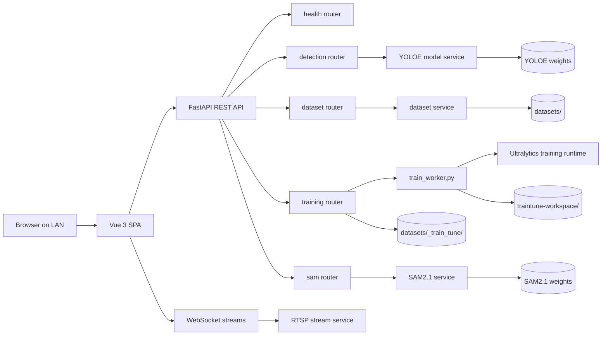

<p align="center">
  
</p>

# LabelLens

[](#tech-stack)
[](#tech-stack)
[](#model-files)
[](#validation-status)

LabelLens is a local-network computer vision workspace for YOLOE-powered object detection, task-aware dataset iteration, and YOLO fine-tuning orchestration. It separates GPU-heavy inference/training workloads in a FastAPI backend from a Vue 3 SPA, with REST APIs for batch workflows and WebSockets for live RTSP streams.

The app is built for fast dataset loops: run prompt-free, text-prompt, or visual-prompt inference; review and correct labels; export YOLO/COCO datasets; then create immutable Train Tune dataset versions and launch training jobs.

## Highlights

| Area | What it does |
|------|--------------|
| Inference Workspace | Free Inference with YOLOE LRPC vocabulary, text prompts, visual prompts via SAVPE, image/video/RTSP inputs, configurable overlays, and a compact detection log. |
| Dataset Manager | Multi-project task-aware dataset workspace for detection, segmentation, single-label classification, multi-label classification, and pose datasets, with overlay gallery, modal review, class colors, and task-native exports. |
| Auto-Labelling | Saves inference results into datasets from image, video, batch upload, or continuous RTSP viewer frames with optional timer control. |
| SAM2.1 Auto-mask | Generates segmentation masks from manual bbox annotations when SAM is available; bbox saves remain non-fatal if SAM fails. |
| Train Tune | Builds immutable detection, segmentation, pose, and single-label classification Dataset Versions, persists training architecture config, previews preprocessing/augmentation policy, recommends settings, runs training jobs, tracks metrics/artifacts, resumes checkpoints, and tests registered model versions. |
| GPU Policy | Defaults LabelLens to physical GPUs `1,2`, leaving physical GPU `0` reserved for vLLM. Train Tune Standard uses GPU `1`; High-Speed uses GPUs `1,2` with AMP off. |

## Validation Status

Implementation is present across backend and frontend. Remaining work is end-to-end validation with real media, model outputs, RTSP feeds, SAM2.1 GPU execution, and real Train Tune detection/segmentation/pose/classification checkpoint runs.

Backend unit tests currently cover dataset and Train Tune service/runtime behavior:

```bash
env/bin/python -m unittest discover backend/tests
```

Current task-aware dataset support includes task selection at New Dataset, annotation-first labels, classification image labels, an Ultralytics-style Pose editor (Move/BBox/Pan-Zoom/Visibility toolbar, anatomically-templated draggable keypoint skeletons, proportional keypoint scaling during bbox resize, bbox-clamped keypoint drag plus full-bbox interior drag to translate the box with all keypoints, cursor-anchored zoom/pan, click-to-cycle visibility, scrollable sidebar dropdown keypoint visibility controls, enriched Pose Instance rows with V/O/M counts and bbox summaries, and edit/update/delete of saved pose instances), toolbar-triggered per-image Pose Infer Assist floating bar (Infer Current) with on-canvas candidate overlay, candidate accept/reject and Accept All, task-matched Rapid Inference using YOLOE prompts for detection, segmentation, and single-label classification plus Ultralytics task models for pose, native exports for classification and pose, and Train Tune snapshot/training support for pose plus single-label classification.

## Architecture



## Tech Stack

| Layer | Technology |
|-------|------------|
| Frontend | Vue 3 Composition API, TypeScript, Pinia, Tailwind CSS v4, Vite |
| Backend | FastAPI, Uvicorn, Python, WebSockets |
| CV Runtime | Ultralytics YOLOE, SAM2.1, PyTorch, OpenCV, Pillow, Albumentations |
| Data/Artifacts | Local filesystem datasets, YOLO TXT, COCO JSON, Train Tune workspace artifacts |
| Communication | REST for image/video/dataset/training APIs, WebSocket for RTSP and training progress |

## Project Structure

```text
LabelLens/
├── frontend/                 # Vue 3 SPA
│   └── src/
│       ├── app/              # App shell, entrypoint, global styles
│       ├── pages/            # mode-select, workspace, datasets, train-tune
│       ├── shared/           # API clients, composables, Pinia stores, shared types
│       └── assets/           # Static frontend assets
├── backend/                  # FastAPI backend
│   ├── routers/              # health, detection, stream, dataset, training, sam
│   ├── services/             # model, dataset, video, rtsp, training, SAM services
│   ├── tests/                # backend unit tests
│   ├── train_worker.py       # background Train Tune worker process
│   └── utils/                # drawing, encoding, masks, postprocess helpers
├── datasets/                 # runtime dataset storage, gitignored
├── docs/                     # project documentation and assets
│   ├── assets/               # README and documentation media
│   ├── plans/                # implementation plans, not intended for commits unless requested
│   └── superpowers/specs/    # design specs, gitignored by project policy
├── models/                   # local model weights
├── temp/                     # runtime/debug snapshots
├── traintune-workspace/      # Train Tune output artifacts
├── DESIGN.md                 # UI design tokens and visual system
├── PRD.md                    # product requirements
├── AGENTS.md                 # agent/project instructions
├── CLAUDE.md                 # mirrored agent/project instructions
└── run-dev.sh                # local frontend + backend runner
```

## Model Files

Place model weights under `models/` on the target machine.

| File | Purpose | Required for |
|------|---------|--------------|
| `models/yoloe-26l-seg.pt` | YOLOE prompt model | Text Prompt, Visual Prompt, image/video/RTSP prompt inference |
| `models/yoloe-26l-seg-pf.pt` | YOLOE prompt-free/LRPC model | Free Inference and prompt-free batch workflows |
| `models/sam2.1_l.pt` | SAM2.1 Hiera Large | Auto-mask generation from manual bbox annotations |

The repository may contain local weights during development, but production and fresh machines should verify these paths explicitly.

## Quick Start

### Prerequisites

- Python 3.10+
- Node.js 18+ and npm
- Backend virtual environment at `env/`
- Required model files in `models/`
- CUDA-capable GPU setup for real inference/training workloads

Install backend dependencies into the repo-local environment:

```bash
env/bin/python -m pip install -r backend/requirements.txt
```

Install frontend dependencies:

```bash
cd frontend
npm install
```

### Run Frontend + Backend

From the repository root:

```bash
./run-dev.sh
```

Default URLs:

| Service | URL |
|---------|-----|
| Frontend | `http://localhost:8282` |
| Backend API | `http://localhost:3131` |
| LAN frontend | `http://<your-ip>:8282` |
| LAN backend | `http://<your-ip>:3131` |

### Run Backend Only

```bash
CUDA_DEVICE_ORDER=PCI_BUS_ID DEVICE=0 \
  env/bin/python -m uvicorn backend.main:app \
  --host 0.0.0.0 \
  --port 3131 \
  --reload
```

### Run Frontend Only

```bash
cd frontend
npm run dev -- --host 0.0.0.0 --port 8282
```

## Core Workflows

### 1. Inference Workspace

1. Open `/` and choose Free Inference or Prompt Inference.
2. In Prompt mode, choose Text Prompt or Visual Prompt.
3. Add image, video, or RTSP input.
4. Adjust confidence, label, bbox, and mask overlay settings.
5. Start inference.
6. Use the floating inference panel for stats and detection logs.
7. Stop inference and clear media before switching input mode.

### 2. Dataset Manager

1. Open `/datasets`.
2. Create or open a dataset project.
3. Add images, sampled video frames, or Rapid Inference uploads.
4. Review thumbnails with real bbox/mask overlays.
5. Open the modal reviewer for zoom/pan inspection.
6. Accept, reject, edit, add, or delete annotations.
7. Use Infer Next to propagate visual-prompt candidates to following images.
8. Export accepted labels as YOLO TXT or COCO JSON.

### 3. Auto-Labelling

1. Open the Workspace Dataset section.
2. Start Auto-Label from the modal.
3. Select target dataset and frame sampling rate.
4. For RTSP, optionally set an `MM:SS` timer.
5. Stop auto-label from the modal or stop inference.

### 4. Train Tune

1. Open `/train-tune`.
2. Select a live dataset or import an export ZIP.
3. Choose Detection, Segmentation, Pose, or single-label Classification.
4. Set the Policy Dataset Split with the combined Train/Valid/Test slider or presets.
5. Configure preprocessing policy: Keep, Letterbox, or Stretch.
6. Choose Basic online augmentation or Advanced materialized augmentation.
7. Generate policy preview samples.
8. Create an immutable Dataset Version; the selected split, family, size, base checkpoint, and training parameters are saved with the version.
9. Review recommended settings and training estimate.
10. Start a training job and monitor `/train-tune/jobs/:id`.
11. Watch task-aware metrics stream from Ultralytics `results.csv`; detection, segmentation, pose, and classification jobs use their matching metric columns.
    Completed Train Tune jobs and model-version cards report best validation metrics selected from the metric history; live progress still shows the latest epoch metrics.
12. Review results at `/train-tune/results/:id`.
13. Test a registered artifact at `/train-tune/test/:id`, or pick one from the Test Model gallery at `/test` (reachable from the landing page).

## Routes

| Route | Purpose |
|-------|---------|
| `/` | Feature Modes landing page |
| `/workspace` | Free/Text/Visual inference workspace after model load |
| `/test` | Test Model — model-version picker (master-detail) |
| `/datasets` | Dataset Manager |
| `/train-tune` | Train Tune builder |
| `/train-tune/jobs/:id` | Live training progress |
| `/train-tune/results/:id` | Training result details |
| `/train-tune/test/:id` | Registered model artifact testing |

## API Surface

Main backend endpoints live under `/api`, except WebSocket stream routes.

| Area | Examples |
|------|----------|
| Health/model | `GET /api/health`, `GET /api/model/status`, `POST /api/model/load`, `POST /api/model/load-custom` |
| Detection | `POST /api/detect/image`, `POST /api/detect/video` |
| Dataset | `GET /api/datasets`, `POST /api/datasets`, `POST /api/datasets/{name}/label-jobs`, `POST /api/datasets/{name}/export` |
| SAM | `GET /api/sam/status`, `POST /api/sam/load`, `POST /api/sam/unload` |
| Training | `GET /api/training/dataset-versions`, `POST /api/training/jobs`, `POST /api/training/jobs/{job_id}/resume`, `GET /api/training/models` |
| WebSockets | `/ws/stream`, `/api/ws/training/{job_id}` |

## Environment Variables

| Variable | Default | Description |
|----------|---------|-------------|
| `MODEL_PATH` | `models/yoloe-26l-seg.pt` | Prompt-mode YOLOE model weights |
| `LABELLENS_CUDA_VISIBLE_DEVICES` | `1,2` | Physical CUDA devices visible to LabelLens |
| `DEVICE` | `0` | Local CUDA device for YOLOE inference after visible-device mapping |
| `SAM_ENABLED` | `true` | Enables SAM2.1 service endpoints and auto-mask attempts |
| `SAM_MODEL` | `sam2.1_l.pt` | SAM model filename or Ultralytics model identifier |
| `SAM_DEVICE` | `1` | Local CUDA device for SAM2.1 after visible-device mapping |
| `CUDA_DEVICE_ORDER` | `PCI_BUS_ID` | Keeps CUDA indexes aligned with `nvidia-smi` PCI order |
| `HOST` | `0.0.0.0` | Backend host |
| `PORT` | `3131` | Backend port |
| `FRONTEND_PORT` | `8282` | Frontend dev server port used by `run-dev.sh` |
| `CORS_ORIGINS` | `*` | Allowed CORS origins |
| `TRAIN_VISIBLE_DEVICES_STANDARD` | `1` | Physical CUDA devices exposed to Standard Mode Train Tune jobs |
| `TRAIN_VISIBLE_DEVICES_HIGH_SPEED` | `1,2` | Physical CUDA devices exposed to High-Speed Train Tune jobs |
| `TRAIN_DEVICE_STANDARD` | `1` | Physical CUDA device string passed to Ultralytics for Standard Mode |
| `TRAIN_DEVICE_HIGH_SPEED` | `1,2` | Physical CUDA device string passed to Ultralytics for High-Speed Mode |
| `TRAIN_AMP_STANDARD` | `true` | Enables AMP for Standard Mode |
| `TRAIN_AMP_HIGH_SPEED` | `false` | Disables AMP for High-Speed DDP on RTX 5080 |
| `LABELLENS_TRAIN_DDP_FIND_UNUSED` | `0` | Set to `1` to opt into the Ultralytics DDP `find_unused_parameters=True` patch |
| `LABELLENS_TRAIN_TUNE_FAKE` | `0` | Set to `1` to run mock training jobs without real weights |

## Runtime Storage

| Path | Purpose |
|------|---------|
| `datasets/` | Dataset projects, images, annotations, exports, and Train Tune dataset metadata |
| `datasets/_train_tune/` | Immutable Dataset Version snapshots and training metadata |
| `traintune-workspace/` | Train Tune run folders, checkpoints, logs, and results CSV files |
| `temp/` | Runtime/debug snapshots |
| `models/` | Local YOLOE and SAM2.1 weights |

## Testing

Run backend unit tests:

```bash
env/bin/python -m unittest discover backend/tests
```

Run frontend typecheck/build:

```bash
cd frontend
npm run build
```

Run both app services for manual validation:

```bash
./run-dev.sh
```

Suggested manual validation checklist:

- Load Free Inference model and run image detection.
- Load Prompt model and run Text Prompt detection.
- Run Visual Prompt detection using a reference image and bbox.
- Process a sample video with frame progress.
- Connect to a known-good RTSP feed.
- Save auto-label results into a dataset.
- Review, edit, accept/reject, and export labels in Dataset Manager.
- Generate SAM2.1 masks from manual bboxes.
- Create Train Tune detection, segmentation, pose, and single-label classification Dataset Versions.
- Auto-Crop detected objects (detection/segmentation) into a target/new dataset as raw HD crops for OK/NG classification annotation.
- Run Standard and High-Speed Train Tune jobs with real checkpoints.
- Open result and Test Model pages for completed model versions. Test Model renders task-matched output: bbox (detect), clipped masks (segment), keypoint skeletons (pose), and a top-1 banner (classification), with task-relevant display toggles and a task-aware Detection Log (pose keypoint counts or classification Top-5).

## Troubleshooting

| Symptom | Check |
|---------|-------|
| Model load fails | Verify `models/yoloe-26l-seg.pt` or `models/yoloe-26l-seg-pf.pt` exists and is readable. |
| Free Inference unavailable | Verify `models/yoloe-26l-seg-pf.pt` is present. |
| SAM status is disabled/offline | Check `SAM_ENABLED`, `SAM_MODEL`, `SAM_DEVICE`, and CUDA availability. |
| CUDA device mismatch | Confirm `LABELLENS_CUDA_VISIBLE_DEVICES`, `DEVICE`, `SAM_DEVICE`, and `CUDA_DEVICE_ORDER=PCI_BUS_ID`. |
| RTSP stream does not connect | Test the RTSP URL separately, then check backend logs and network/firewall access. |
| Train Tune job fails immediately | Verify checkpoint path, task type compatibility, dataset version labels, and GPU policy env vars. |
| Train Tune completed without a checkpoint | Inspect `results.csv` for non-finite loss/metric values; the worker now reports the first affected epochs when `best.pt`/`last.pt` is missing. |
| High-Speed DDP errors | Keep `TRAIN_AMP_HIGH_SPEED=false`; try Standard Mode to isolate multi-GPU issues. |
| Frontend cannot reach backend | Confirm backend is on `0.0.0.0:3131` and CORS/network settings allow the client host. |

## Documentation Index

| File | Purpose |
|------|---------|
| `PRD.md` | Product requirements and feature intent |
| `DESIGN.md` | Supabase-inspired design system and UI tokens |
| `AGENTS.md` | Project state and agent operating rules |
| `CLAUDE.md` | Mirrored project state and agent operating rules |
| `docs/ARCHITECTURE.md` | Frontend/backend/service/data flow architecture |
| `docs/API.md` | FastAPI endpoint catalog and WebSocket notes |
| `docs/MODELS.md` | YOLOE, SAM2.1, checkpoint, and GPU mapping guide |
| `docs/WORKFLOWS.md` | End-to-end operator workflows |
| `docs/TESTING.md` | Unit, build, manual E2E, and hardware validation checklist |
| `docs/INSTALLATION.md` | Full installation guide (prerequisites, setup, config, troubleshooting) |
| `docs/OPERATIONS.md` | Local LAN runbook, runtime paths, env vars, troubleshooting |
| `docs/REFERENCES.md` | External and project-local reference catalog |
| `docs/plans/` | Implementation plans created during development |

## References

LabelLens uses more than YOLOE. See `docs/REFERENCES.md` for the full reference catalog.

Core references:

| Area | Reference |
|------|-----------|
| YOLOE | `https://github.com/THU-MIG/yoloe` |
| Ultralytics YOLOE | `https://docs.ultralytics.com/models/yoloe` |
| SAM via Ultralytics | `https://docs.ultralytics.com/models/sam/` |
| FastAPI | `https://fastapi.tiangolo.com/` |
| Vue 3 | `https://vuejs.org/guide/introduction.html` |
| Vite | `https://vite.dev/guide/` |
| OpenCV | `https://docs.opencv.org/` |
| Albumentations | `https://albumentations.ai/docs/` |

## License

Internal project - not for public distribution.
