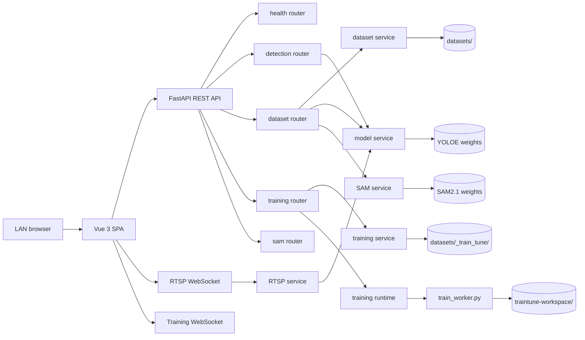

# LabelLens Architecture

LabelLens is split into a Vue 3 single-page frontend and a FastAPI backend. The frontend owns interaction state and review workflows. The backend owns GPU model loading, inference, dataset persistence, training orchestration, and media processing.

## System Diagram

## Frontend

The frontend lives in `frontend/src/`.

| Area | Responsibility |
|------|----------------|
| `app/` | App entry, global style, route selection by current path |
| `pages/mode-select/` | Feature Modes landing page at `/` |
| `pages/workspace/` | Image, video, RTSP, prompt, settings, viewer, auto-label UI |
| `pages/datasets/` | Dataset Manager overview, gallery, modal review, annotation editor, exports |
| `pages/train-tune/` | Train Tune builder, job monitor, result page, model test page |
| `shared/api/` | REST API clients for backend routers |
| `shared/stores/` | Pinia state for inference, datasets, and training |
| `shared/composables/` | Backend/model/SAM status and WebSocket helpers |

Routing is intentionally lightweight in `frontend/src/app/App.vue`: it switches page components from `window.location.pathname` rather than using a router package.

## Backend

The backend lives in `backend/`.

| Area | Responsibility |
|------|----------------|
| `main.py` | FastAPI app, CORS, router registration |
| `routers/health.py` | Health, model status, YOLOE load, custom model load |
| `routers/detection.py` | Image and video detection endpoints |
| `routers/stream.py` | RTSP WebSocket inference endpoint |
| `routers/dataset.py` | Dataset CRUD, upload, rapid inference, review, export, SAM mask generation |
| `routers/training.py` | Dataset Versions, training jobs, metrics, model registry, training WebSocket |
| `routers/sam.py` | SAM2.1 status/load/unload endpoints |
| `services/model.py` | YOLOE model lifecycle and predict methods |
| `services/dataset.py` | Dataset storage, annotations, export serialization |
| `services/training.py` | Dataset Version snapshots, job metadata, model registry, metrics |
| `services/training_runtime.py` | Background job queue and worker process supervision |
| `train_worker.py` | Ultralytics training execution and event streaming |

## Runtime Data Flow

### Prompt inference

1. User selects Free, Text, or Visual mode.
2. Frontend loads the correct model through `/api/model/load`.
3. Frontend posts image or video input to `/api/detect/image` or `/api/detect/video`.
4. Backend calls `model_service.predict_free()`, `predict_text()`, or `predict_visual()`.
5. Backend renders overlays and returns detections, stats, and annotated media.

### RTSP inference

1. Frontend opens `/ws/stream`.
2. First WebSocket message sends RTSP URL, prompt type, labels, confidence, overlay flags, and optional visual-prompt data.
3. Backend creates an `RTSPStream`, reads frames, runs model inference, and sends JSON frame payloads back.
4. Disconnect or error stops the stream and clears inference activity state.

### Dataset review

1. Dataset images and annotation JSON are stored under `datasets/<name>/`.
2. Gallery and review UI fetch metadata and images from `/api/datasets/{name}/images`.
3. Manual edits use detection CRUD endpoints.
4. Export endpoints serialize accepted labels into YOLO TXT or COCO JSON zip files.

### Train Tune

1. Builder creates a Dataset Version from a live dataset or exported ZIP.
2. `training_service` writes immutable snapshot files under `datasets/_train_tune/`.
3. A training job is queued through `/api/training/jobs`.
4. `training_runtime` starts `train_worker.py` in the background.
5. `train_worker.py` runs Ultralytics, emits events, and writes artifacts under `traintune-workspace/`.
6. Completed jobs register Model Versions for result review and artifact testing.

## Activity Guard

`activity_service` prevents conflicting heavy operations. Inference starts and stops around image/video/RTSP requests. Train Tune high-speed jobs are blocked when inference is active.

## Storage Layout

| Path | Owner | Purpose |
|------|-------|---------|
| `models/` | Operator | YOLOE and SAM2.1 weights |
| `datasets/` | Backend dataset service | Dataset projects, images, annotation metadata, exports |
| `datasets/_train_tune/` | Training service | Dataset Versions, job metadata, model registry |
| `traintune-workspace/` | Train worker | Ultralytics run outputs, checkpoints, logs, results CSV |
| `temp/` | Runtime/debug flows | Temporary snapshots and diagnostics |
